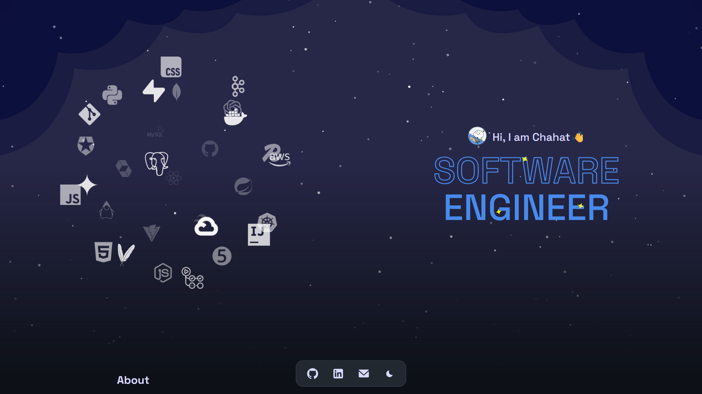

# 🌐 Chahat's Personal Portfolio



Welcome to my personal portfolio — a sleek, modern website built with **React + Vite**. It showcases my skills, projects, and experiences as a full-stack developer focused on building secure, scalable, and elegant web applications.

---

## 🚀 Features

- ⚡ Fast and lightweight build using **Vite**
- 🎨 Dark/light theme toggle with persistent user preferences
- 🖼️ Animated sections, icon clouds, and interactive tooltips
- 📄 Resume button with PDF download
- 🧩 Modular components and clean folder structure

---

## 🛠️ Tech Stack

| Frontend | Build Tool | Styling | Deployment |
|----------|------------|---------|------------|
| React    | Vite       | CSS Modules | Firebase Hosting |

---

## 🖼️ Preview


Visit the live version: [Chahar's Personal Portfolio](https://chahat-portfolio-1001.web.app)

---

## ⚙️ Local Setup

```
# Clone the repository
git clone https://github.com/chahatsharma1/chahat-portfolio.git

# Install dependencies
npm install

# Start development server
npm run dev
```